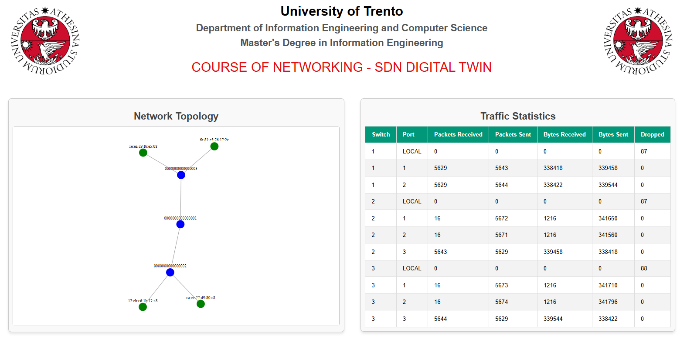

# DigitalTwin SDN


## Index
- [Project Description](#Project-Description)
- [Link](#Link)
- [Implementation Details](#Implementation-Details)
- [Project Layout](#Project-Layout)
- [Installation](#Installation)
- [Demo](#Demo)
- [Contacts](#Contacts)

## Project Description

This is the project of the Networking (mod. 2) course of the University of Trento.
The main goal of this project is to build a script that, using the RYU Northbound RestAPI and retrieving the topology and the traffic informations, allows to generate the Digital Twin of a  SDN network.
This procedure has to be completely automated: runtime, changes to the Physical Twin are reproduced automatically to the Digital Twin


[Back to the index](#Index)


## Link

[**Presentation Link**](https://docs.google.com/presentation/d/1ULJuVBcUslIpldoW_BwQPWuk5LzKMG0_OoHpBfltg84/edit?usp=sharing)

[**Demo Link**](https://) 

[Back to the index](#Index)

## Implementation Details
**ENVIRONMENT:**

This project makes substantial use of ComNetsEmu and Mininet. ComNetsEmu is a tested and network emulator designed for the NFV/SDN teaching book "Computing in Communication Networks: From Theory to Practice". The design focuses on emulating all the applications on a single computer. ComNetsEmu extends the famous Mininet network emulator. Mininet creates a realistic virtual network, running real kernel, switch and application code, on a single machine. The programming language used is Python. The project was developed in a dedicated virtual machine with Linux operating system.

**NETWORK DESCRIPTION:**

The phisical network is defined in the script CLI.PY, by default it is a tree topology with a root switch and 2 switch connected to it. The last 2 switch has 2 hosts connected. It is possibile to change this topology by modifying the specific line of code and the system will continue to work properly.


**CLI:**

The user can interact with the system with a Command Line Interface, trrough which he can activate/deactivate the links. 
Mininet considers links only the connection between swithes, so we can't affect links that connect switches and hosts.


**NETWORK VISUALIZATION:**


The Digital Twin of the Phisical Twin can be viewed via a web page.
Every time the user activate/deactivate a link, the topology of the Digital Twin is automatically updated, according to the changes made.


 


[Back to the index](#Index)


## Project Layout


**app.py:** is the main file of the project, containing the Flask application that manages the visualization and interaction with the network topology. It defines several endpoints:

- ```/```: the main page that serves the user interface.
- ```/get_topology```: returns the dynamic network topology in JSON format, including switches, links, and hosts.
- ```/link/<switch>/<host>/<status>```: allows modifying the state of a link between a switch and a host, using the link down or link up commands to disable or re-enable the link via Mininet.
- ```get_traffic_stats()```: retrieves network traffic statistics for the links in the topology
- The RYU Northbound API that we use are:
  - for retrieving the topology: ```http://localhost:8080/v1.0/topology/switches``` , ```http://localhost:8080/v1.0/topology/hosts``` and ```http://localhost:8080/v1.0/topology/links```
  - for retrieving the network traffic statistics: ```http://localhost:8080/stats/port/{dpid}``` , where dpid is the identifier of the switches.

**index.html:** index.html serves as the front-end interface for displaying and interacting with the SDN Digital Twin network topology. It uses D3.js to visualize the network's switches, hosts, and links in an interactive and dynamic layout. The topology is updated periodically, reflecting the current state of the network. Additionally, the page includes a section that dynamically displays traffic statistics, such as packets and bytes received/sent for each switch and port. This allows users to monitor the real-time performance of the network.

**cli.py:** is a Python script that allows the user to interact with Mininet through a command-line interface (CLI). In particular: it uses the pexpect module to automate the process of starting Mininet, managing network links, and executing commands. The script starts Mininet with a specified topology (tree,2). It then provides the user with options to activate or deactivate links between switches in the Mininet network by sending the appropriate commands.

**Makefile:** automates the process of running and stopping the project. The principal target that we use are:
- ```make```: first of all cleans the mininet states using ```sudo mn -c```. Then proceed to start the necessary processes:
  - Ryu controller: in background with the command ```ryu-manager ryu.app.rest_topology ryu.app.ofctl_rest ryu.app.simple_switch_13 --observe-links```;
  - The application: in backgound with the command  ```python3 app.py``` (which serves the web interface)
  - CLI: The cli.py script is run in the foreground, with ```python3 cli.py``` , allowing the user to interact with the network via the command-line interface.
- ```make stop```:Stops the processes started by run by killing the Ryu controller and application processes

**style.css:** This file improves the visual appearance of the web interface by styling elements like tables, text, and the network topology visualization, making the page more attractive and user-friendly.


[Back to the index](#Index)


## Installation
You can run this project by following this steps:
1. Install comnetsemu using VirtualBox (option A) at this [link](https://www.granelli-lab.org/researches/relevant-projects/comnetsemu-labs)

2. download this project via git commands. Then, open 3 terminals in this directory:

```
cd /home/comnetsemu/comnetsemu/app/DigitalTwinSDN
```

3. Thanks to the Makefile, we need only one terminal in which we run the command  ```make```. The controller and the application starts in background (with the commands ```ryu-manager ryu.app.rest_topology ryu.app.ofctl_rest ryu.app.simple_switch_13 --observe-links``` and ```python3 app.py```, respectively), while in the foreground cli.py starts (which, as mentioned before, starts mininet with the command ```sudo mn --topo tree,2 --controller remote```).

(It's possible that you have to insert the administrator password, which is by default ```comnetsemu``` )

At this point it's possible to view the digital twin topology via web at ```http://localhost:5000``` and it's possible to interact with the system by acrivate/deactivate a link using the menu shows by cli.py

 

[Back to the index](#Index)

## Demo

This section will explain a complete usage example of this application.
It is based on the demo video in the "Link" section.
Suppose you have already done the installation  and have already run the command ```make``` (as explained in the previous section).
Run the following command in the cli:

| CLI                                                                               |
|-----------------------------------------------------------------------------------|
|1. Select: ```1```  to enter in the deactivation mode                              |
|2. Insert the first switch you want to disconnect, for example ```s1```            |  
|3. Insert the second switch you want to disconnect, for example ```s2```           |  
|4. Select: ```2```  to enter in the activation mode                                |
|5. Insert the first switch you want to connect: in this example ```s1```           |  
|6. Insert the second switch you want to connect, in this example ```s2```          | 
|7. You can repeat the previous steps with different entity                         |


After step 3, the link that connect switch s1 and switch s2 is disconnected and this change will appear in the web topology.

 | cli                                  | web 
|---------------------------------------|---------------------------------------
| | 


After step 6, the connection between s1 and s2 return up, and the topology will be updated accordingly

| cli                                   | web 
|---------------------------------------|---------------------------------------
|     | 


[Back to the index](#Index)

## Contacts
Nicola Cappellaro - nicola.cappellaro@studenti.unitn.it

Riccardo Zannoni - riccardo.zannoni@studenti.unitn.it

[Back to the index](#Index)

